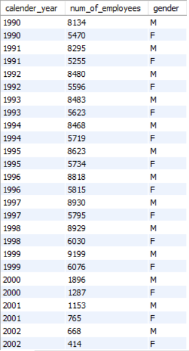
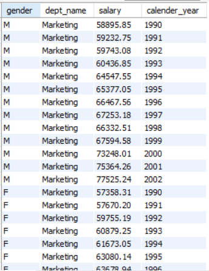
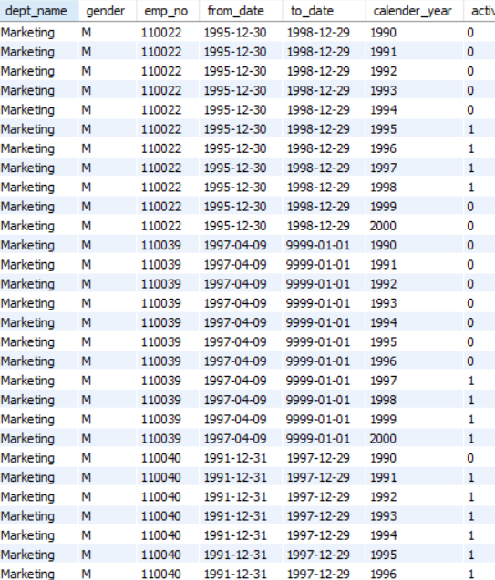
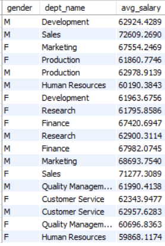

# Integration of various databases to software application

Example MySQL Schemas from open-source projects

You can contribute any schema with the following syntax:

Existing schemas include:
- employees.sql - http://bazaar.launchpad.net/~sandbox-developers/test-db/employees_db_1/download/head:/employees.sql-20080729220128-yub0xyoby9skmnf3-4/employees.sql
- classicmodels.sql - http://www.mysqltutorial.org/mysql-sample-database.aspx

### SQL and Tableau,
Tabluea quickly connect to a server such as the SQL server, extracting the necessary data applying relevant calculations and then visualizing the obtained information

Tableau can help create:
1. Graphs
2. Charts
3. Reports
4. Dashboards

In general Dashboard and reports is a must for any business intelligence analyst out there. Infact it allow end users such as company executives and general managers to understand the core of a business and extract insights about it.

Hence, integrating SQL and Tableau is about taking your data from the depths of your database to its esteemed beautiful representation in Tableau

Re-organizing your data in a proper format for analysis
 - Tableau is not the best place to complete the preprocessing step
 - Pre-processing on a database level, instead, is associated with much better performance

Knowledge in SQL can help you a great deal while working with Tableau

Problem Structure
1. Receive a business task
2. Use SQL to execute a query retrieving a relevant dataset from the database
3. Export the newly obtained data in a csv file to be used in Tableau
4. Create a professional and understandable visualization in Tableau, that will clearly respond to the initial business task and will help end users come up with business insights

#### Task 1:
Create a visualization that provides a breakdown between the male and female employees working in the company each year, starting from 1990. 

#### Task 2:
Compare the number of male managers to the number of female managers from different departments for each year starting from 1990

#### Task 3:
Compare the average salary of female versus male employees in the entire company until year 2002, and add a filter allowing you to see that per each department

#### Task 4:
Create an SQL stored procedure that will allow you to obtain the average male and female salary per department within a certain salary range. Let this range be defined by two values the user can insert when calling the procedure. Finally, visualize the obtained result-set in Tableau as a double bar chart.

Here, is the visualization on Tableau - https://public.tableau.com/profile/dennis.irorere#!/vizhome/EmployeeAnalysis_15698865911450/Dashboard1?publish=yes